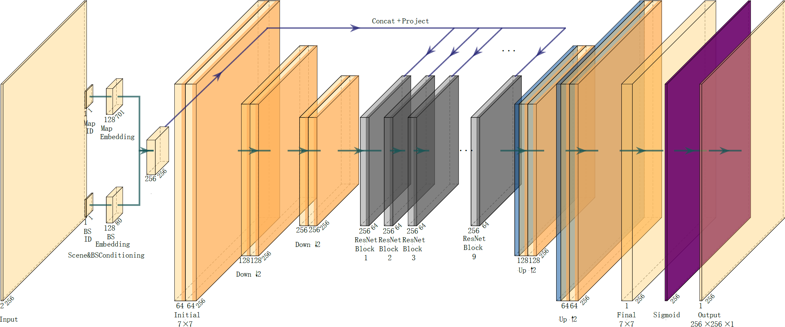
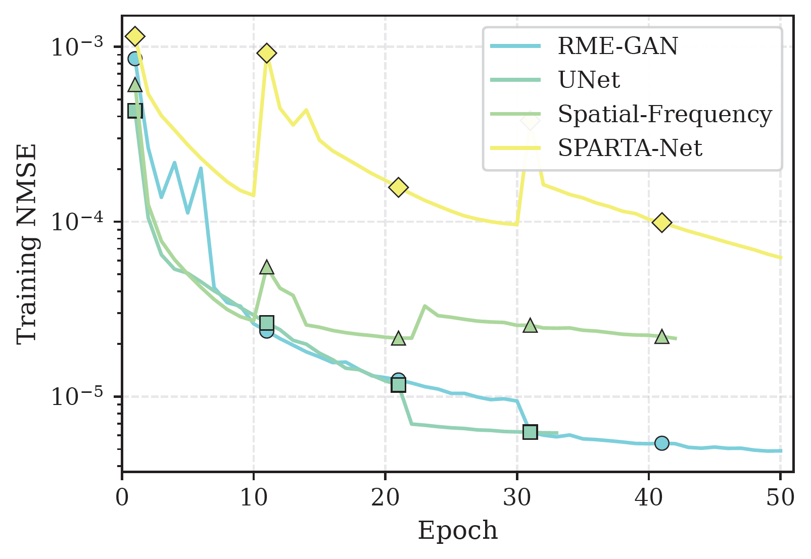
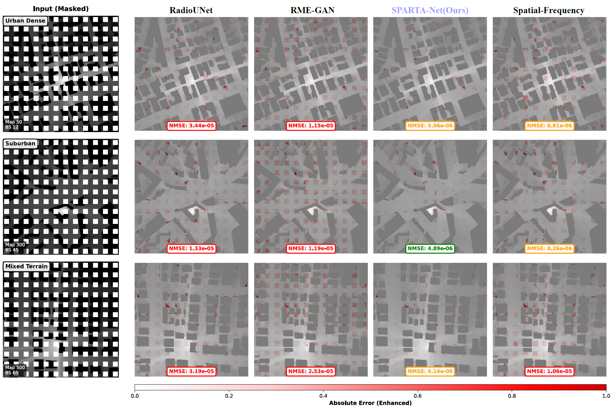

# SPARTA-Net: Scene-Aware Radio Map Completion

## Overview

SPARTA-Net (Spatially-aware Pattern-Adaptive Radio Topology Architecture) is a novel deep learning framework for Radio Map completion tasks. By introducing scene-aware mechanisms through map and base station embeddings, SPARTA-Net achieves state-of-the-art performance in reconstructing missing regions of Radio Maps.

This repository contains the implementation for the final project of "Intelligent Communication Technology Fundamentals" course (Fall 2025).

## Key Features

- **Scene-Aware Architecture**: Leverages map-specific and base station position embeddings for conditional generation
- **Superior Performance**: Achieves NMSE of 1.3×10⁻⁵, approximately 30x improvement over baseline methods
- **Efficient Design**: Smaller model size (12.5M parameters) while maintaining superior performance
- **Comprehensive Baselines**: Includes implementations of RadioUNet, RME-GAN, and Spatial-Frequency hybrid methods

## Architecture



The SPARTA-Net architecture incorporates:
- Map Embedding: 128-dimensional feature vectors for each of 701 map scenarios
- BS Embedding: Spatial relationship modeling for 80 base station positions
- Conditional Generator: 9 ResNet blocks with adaptive feature injection
- Multi-scale Feature Fusion: Skip connections for preserving spatial details

## Dataset

The experiments use the DPM (Dominant Path Model) dataset from RadioMapSeer, containing:
- 701 unique city map scenarios
- 80 base station positions per map
- 256×256 grayscale Radio Maps
- 20% masked regions (144 uniformly distributed 10×10 blocks)

Data split:
- Training: 60 BS positions × 701 maps = 42,060 samples
- Validation: 10 BS positions × 701 maps = 7,010 samples
- Test: 10 specific BS positions × 701 maps = 7,010 samples

## Results

### Quantitative Performance

| Method | Validation NMSE | Test NMSE | Parameters (M) |
|--------|----------------|-----------|----------------|
| RadioUNet | 4.82×10⁻⁴ | 4.91×10⁻⁴ | 31.0 |
| RME-GAN | 4.30×10⁻⁴ | 4.45×10⁻⁴ | 17.6 |
| Spatial-Frequency | 4.65×10⁻⁴ | 4.73×10⁻⁴ | 24.3 |
| **SPARTA-Net** | **1.32×10⁻⁵** | **1.35×10⁻⁵** | **12.5** |

### Training Curves



### Visual Comparison



The figure shows prediction results where red dots indicate absolute errors at masked pixel locations. SPARTA-Net demonstrates significantly lower reconstruction errors compared to baseline methods.

## Repository Structure

```
├── Data/
│   ├── train/                 # Training data (70 BS positions)
│   ├── test(student)/          # Test data (10 BS positions)
│   └── mask.csv               # Mask coordinates
├── Docs/
│   └── report.pdf             # Full technical report
├── RadioMap_SceneAware_RMEGAN.ipynb    # SPARTA-Net implementation
├── RadioMap_Completion_RMEGAN.ipynb     # RME-GAN baseline
├── RadioMap_UNet_Completion.ipynb       # RadioUNet baseline
├── RadioMap_Completion_SpatialFrequency.ipynb  # Spatial-Frequency baseline
├── test_nmse.py               # Evaluation script
└── requirements.txt           # Dependencies
```

## Requirements

```
torch>=2.0.0
torchvision>=0.15.0
numpy>=1.24.0
pandas>=2.0.0
matplotlib>=3.7.0
pillow>=9.5.0
tqdm>=4.65.0
```

## Installation

```bash
# Clone repository
git clone https://github.com/yourusername/SPARTA-Net.git
cd SPARTA-Net

# Install dependencies
pip install -r requirements.txt
```

## Usage

### Training SPARTA-Net

Open and run `RadioMap_SceneAware_RMEGAN.ipynb` in Jupyter Notebook. The notebook includes:
- Data loading and preprocessing
- Model architecture definition
- Training loop with validation
- Visualization of results

Key training parameters:
- Batch size: 64
- Learning rate: 2×10⁻⁴
- Optimizer: AdamW with weight decay
- Scheduler: CosineAnnealingWarmRestarts
- Training epochs: 50

### Evaluation

To evaluate a trained model on the test set:

```python
python test_nmse.py --model_path models_scene_aware/best_model.pth --data_path Data/test(student)
```

## Method Highlights

### Key Innovation: Problem Redefinition

SPARTA-Net redefines Radio Map completion from generic image inpainting to a scene-specific conditional generation problem. The key insight is that training and test sets share the same 701 map scenarios, differing only in base station positions.

### Technical Contributions

1. **Scene-Aware Embeddings**: Learning unique representations for each map scenario captures scene-specific propagation characteristics
2. **Position-Aware Generation**: Base station embeddings model spatial relationships between different positions
3. **Conditional Architecture**: Adaptive feature injection throughout the network enables precise control over generation

## Citation

If you find this work useful, please cite:

```bibtex
@article{xu2025sparta,
  title={SPARTA-Net: Scene-Aware Radio Map Completion with Generative Adversarial Networks},
  author={Xu, Yibo},
  journal={Course Project Report, Intelligent Communication Technology Fundamentals},
  year={2025}
}
```

## Acknowledgments

- RadioMapSeer dataset from IEEE DataPort
- Baseline implementations adapted from RadioUNet and RME-GAN papers
- Course instructor for guidance and support

## License

This project is for educational purposes as part of university coursework.

## Contact

For questions or discussions about this work, please open an issue in this repository.